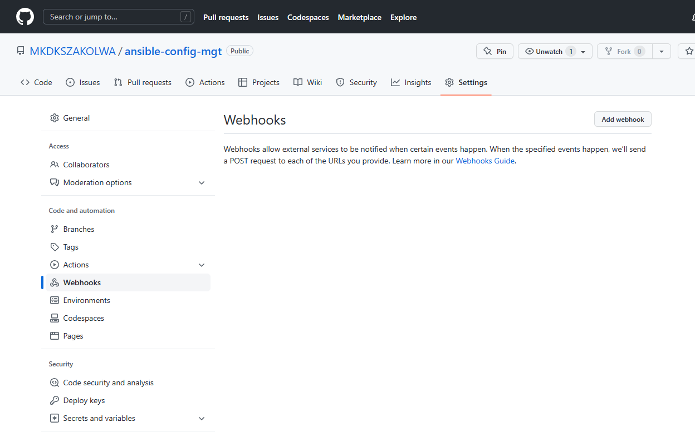
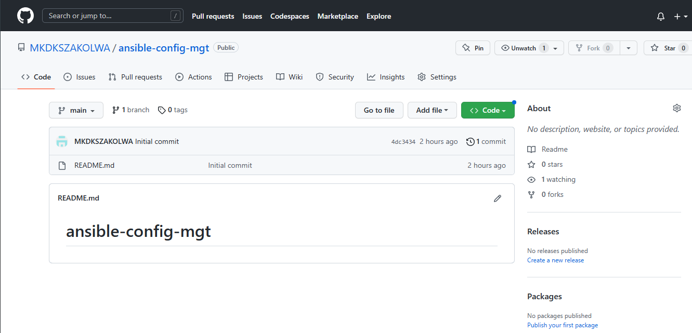
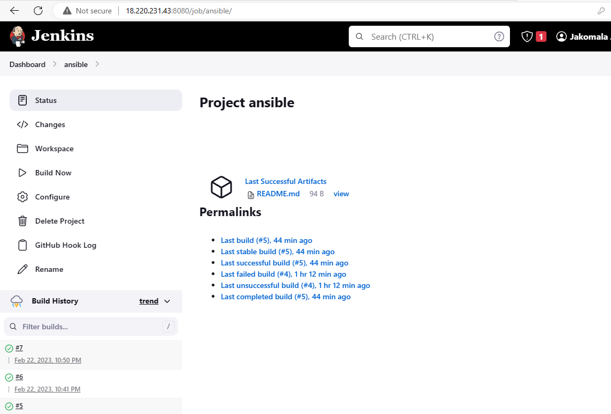
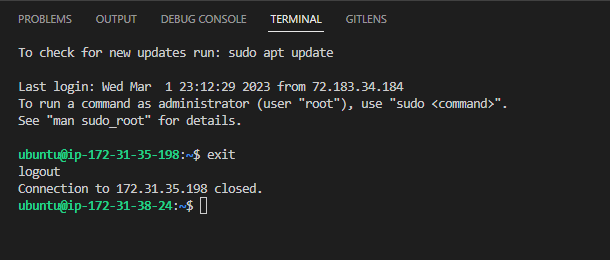
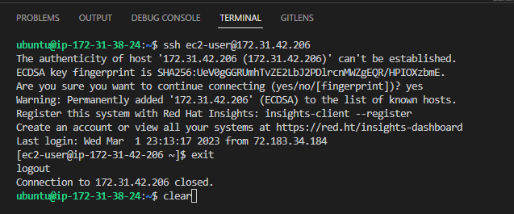
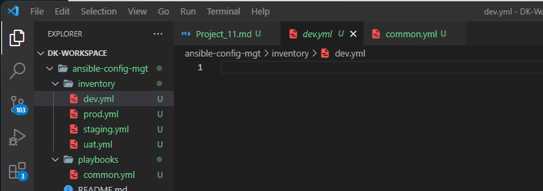
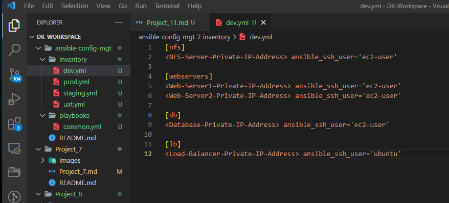
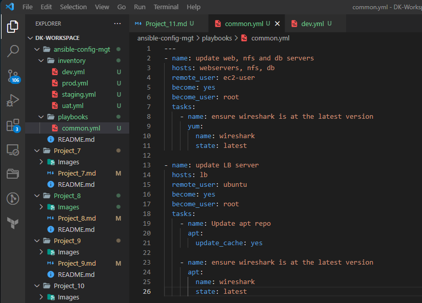

# PROJECT 11: ANSIBLE CONFIGURATION MANAGEMENT - AUTOMATE PROJECT 7-10

- In project 7-10, we had to perform alot of manual operations to set up virtual servers, install and configure required software, and deploy the web application.
- This project will allow us to appreciate more the DevOps tools by making most of the routine tasks automated with *Ansible Configuration Management*. At the same time we will be confident in writing code using declarative language such as *YAML*.


## Ansible Client as a Jump Server (Bastion Host)

A *Jump Server* (sometimes also referred as *Bastion Host*) is an intermediary server through which access to internal network can be provided. If you think about the current architecture you are working on, ideally, the webservers would be inside a secured network which cannot be reached directly from the Internet. That means, even DevOps engineers cannot SSH into the Web servers directly and can only access it through a Jump Server – it provide better security and reduces attack surface.

On the diagram below the Virtual Private Network (VPC) is divided into two subnets – Public subnet has public IP addresses and Private subnet is only reachable by private IP addresses.


When you reach Project 15, you will see a Bastion host in proper action. But for now, we will develop Ansible scripts to simulate the use of a Jump box/Bastion host to access our Web Servers.

## Tasks
- Install and configure Ansible client to act as a Jump Server/Bastion Host
- Create a simple Ansible playbook to automate servers configuration


## STEP 1 - INSTALL AND CONFIGURE ANSIBLE ON EC2 INSTANCE


1. Update Name tag on your Jenkins EC2 Instance to Jenkins-Ansible. We will use this server to run playbooks.

   Select the EC2 Jenkins server that you used in Project 9 and update it to Jenkins_Ansible.

   

- Connect to the Jenkins_Ansible terminal using SSH.


  


2. In your GitHub account create a new repository and name it ansible-config-mgt.

   Login to your github.

   

   Click on New repository (Green icon with New).

   

   Name the repository as *ansible-config-mgt* , c check *add a README file, and then click *Create repository*.

   

   The screen below will be generated.

   


3. Instal Ansible.

   `sudo apt update`

   
   
   `sudo apt install ansible`. Click Y when prompted.

   
   
   Check your Ansible version by running;
   
   `sudo ansible --version`

   

4. Configure Jenkins build job to save your repository content every time you change it – this will solidify your Jenkins configuration skills acquired in Project 9.

    - Create a new Freestyle project ansible in Jenkins and point it to your ‘ansible-config-mgt’ repository.
    
      Login to ansible through the browser. Use your Public IP address for Jenkins_Ansible server. 

      http://18.220.231.43:8080

      The screen below will be displayed.

      


      Login with your credentials.

      Username : Project9_Admin

      Password: password


      Click New Item.


      

      Enter item name as *ansible*, click on *Frestyle project* and click ok.

      


      Change Source Code to *Git*.


      


      To connect your GitHub repository, you will need to provide its URL. You can copy from the repository itself.
      
      Go to the repository that you created in your Github and then under code , copy the https url as shown below.


      

      https://github.com/MKDKSZAKOLWA/ansible-config-mgt.git

      Copy it under repository url.

      

      Click Add under Credentials, then click on Jenkins.


      


      Get your Github credentials (Username and Password) and input in the below page, then click Add.


      


      Save.

      


      The screen below will be displayed.

      


      Click "Configure"  and add these two configurations. 

      


      Configure triggering the job from GitHub webhook:

      Under Build Triggers select Github hook trigger for GITscm polling.


      


      Under Source Code scroll down to branches to build, replace *master* with *main* under Branch specifier.


      


      Click Save.

      


    - Configure a Post-build job to save all (**) files, like you did it in Project 9. – files resulted from a build are called "artifacts".

      

      Put ** under Files to Archive and then save.


      


      Save.


      


      The screen below will be displayed.

      


    - Configure Webhook in GitHub and set webhook to trigger ansible build.

      This job will will be triggered by GitHub webhooks and will execute a ‘build’ task to retrieve codes from GitHub and store it locally on Jenkins server.

      Enable webhooks in your GitHub repository settings.

      Go back to your Github account.

      


       Click on Settings and then Webhooks.


       

       Add Webhook.

       


       You wil be prompted to confirm access.


       


       The screen below will be displayed once you have successfully logged in.


       


        Copy the Jenkins link and paste it under "Payload URL" in Github. Ensure you add github-webhook/ as shown below.

       `http://18.220.231.43:8080/github-webhook/`

       Under Content Type, select application/json

       Leave everything as defaulted with Just the push event and Active selected.


       


       Click Add Webhook.


       


       The screen below will be displayed.


       


       Go back to jenkins and  click Build Now.

      


      It will show a successful Build for # 5.

      


5. Test your setup by making some change in README.MD file in master branch and make sure that builds starts automatically and Jenkins saves the files (build artifacts) in following folder.


   

   Click the READ.ME.md file to edit.


   


   Click edit on the top right side of the screen to display the screen below.

   

   At the bottom of the file add the statement "Testing the setup of Jenkins in Project 11 by editing the README.md file" . This can be anything .


   

   Then click "Commit Changes".


   


   Go back to jenkins and it will show a green check mark for Build # 7 at the bottom.

   


   Click on # 7

   


   Click on Console Output.

   


   It will show that it finished successfully.


   


   We have now configured an automated Jenkins job that receives files from GitHub by webhook trigger (this method is considered as ‘push’ because the changes are being ‘pushed’ and files transfer is initiated by GitHub).

    By default, the artifacts are stored on Jenkins server locally.


    `ls /var/lib/jenkins/jobs/ansible/builds/<build_number>/archive/`


    To do this;
    `cd /var/lib`
    `cd jenkins`
    `cd jobs`
    `cd ansible`
    `cd builds`
    `cd 7`
    `cd archive`

    `ll`


    


    Note: Trigger Jenkins project execution only for /main (master) branch.

    Now your setup will look like this:


    

Tip Every time you stop/start your *Jenkins_Ansible* server – you have to reconfigure GitHub webhook to a new IP address. In order to avoid that, it makes sense to allocate an Elastic IP to your *Jenkins_Ansible* server (you have done it before to your LB server in *Project 10*). Note that Elastic IP is free only when it is being allocated to an EC2 Instance, so do not forget to release Elastic IP once you terminate your EC2 Instance.


## Step 2 – Prepare your development environment using Visual Studio Code.

1.  part of ‘DevOps’ is ‘Dev’, which means you will require to write some codes and you shall have proper tools that will make your coding and debugging comfortable – you need an *Integrated development environment (IDE) or Source-code Editor*. There is a plethora of different IDEs and Source-code Editors for different languages with their own advantages and drawbacks, you can choose whichever you are comfortable with, but we recommend one free and universal editor that will fully satisfy your needs – *Visual Studio Code (VSC)*, you can get it here.

2. After you have successfully installed VSC, configure it to *connect to your newly created GitHub repository*. We already have VSC code installed so we do not have to reinstall it.

   We need to install am extension called *Remote Development*. Go to VS Code and search for *Remote Development*. This helps to SSH and open folders to remote server.

   


   Click Install.


3. Clone down your ansible-config-mgt repo to your Jenkins-Ansible instance

   git clone <ansible-config-mgt repo link>


   Go to github under your account/ansible-config-mgt.

   

   Open Code (green) and copy the SSH link.

   

   `git@github.com:MKDKSZAKOLWA/ansible-config-mgt.git`

   In VS Code at the top click on Terminal > New Terminal.

   The screen below will open up under your Workspace.

   

   Run the command below. 

   `git clone <ansible-config-mgt repo link>`

   Replace it with your link from github.


   `git clone git@github.com:MKDKSZAKOLWA/ansible-config-mgt.git`

   


   The screen below will be displayed showing that the clone has been completed.

   

   You can confirm the clone by seeing the repository cloned under Explorer as shown below.

   


## BEGIN ANSIBLE DEVELOPMENT

1. In your *ansible-config-mgt* GitHub repository, create a new branch that will be used for development of a new feature.

   ### Tip
   Give your branches descriptive and comprehensive names, for example, if you use Jira or Trello as a project management tool – include ticket number (e.g. *PRJ-145*) in the name of your branch and add a topic and a brief description what this branch is about – *a bugfix, hotfix, feature, release (e.g. feature/prj-145-lvm)*.

   If you closed the terminal in VS Code then open it by Terminal > New Terminal. The screen below will be displayed.

   

   Run the command below to change the directory to *ansible-config-mgt* =.

   `cd ansible-config-mgt`

   

   Create a new directory by running the command below. We will call it prj-11.

   `git checkout -b prj-11`


   

   Run `git push origin prj-11`. This allows for the created branch to be pushed to Github as it is just currently in the local machine.

   


   To confirm the branch run;

   `git branch`

   

   Note: to switch branch you can run the command below. In our case we dont have to at this time.

   `git switch <the branch you want to switch to>`

   Example

   `git switch main`


2. Checkout the newly created feature branch to your local machine and start building your code and directory structure.

3. Create a directory and name it playbooks – it will be used to store all your playbook files. You can perform the step directly from the terminal in VS Code or opening a new terminal from file explorer as explained below.

   Open file explorer

   Manuever to your workspace: 

   Documents > DevOps Training > DK_WORKSPACE

   Right click DK_WORKSPACE and open in Terminal

   `cd ansible-config-mgt`

   The screen below will be displayed.

   

   Corfirm your branch.

   `git branch`

   

   Create playbooks directory

   `cd mkdir playbooks`

   

   The screen below will show the created playbooks directory.

   

   

4. Create a directory and name it inventory – it will be used to keep your hosts organised.

   Another way to create a directory is go straight to VS Code under ansible-config-mgt and click on the folder (second box). Name it inventory.

   


   


5. Within the playbooks folder, create your first playbook, and name it common.yml.

   Put your curson on playbooks and create a file (first icon).

   

   The screen below will be displayed.

   


6. Within the inventory folder, create an inventory file (.yml) for each environment (Development, Staging Testing and Production) dev, staging, uat, and prod respectively.

   `cd inventory`

   

   Run the command below to create inventory files as mentioned above. Touch does not work in Powershel but in Git bash. So open Git bash and navigate to the directory below by running `cd` to each directory.

   /OneDrive/Documents/DevOps Training/DK-Workspace/ansible-config-mgt


   

   Move to inventory directory.

   `cd inventory`

   


   `touch dev.yml staging.yml uat.yml prod.yml`

   

   The screen below shows that the inventory files have been created.

   


### Step 4 – Set up an Ansible Inventory


   An Ansible inventory file defines the hosts and groups of hosts upon which commands, modules, and tasks in a playbook operate. Since our intention is to execute Linux commands on remote hosts, and ensure that it is the intended configuration on a particular server that occurs. It is important to have a way to organize our hosts in such an Inventory.

   - Save below inventory structure in the inventory/dev file to start configuring your development servers. Ensure to replace the IP addresses according to your own setup.

   - Note: Ansible uses TCP port 22 by default, which means it needs to ssh into target servers from Jenkins-Ansible host – for this you can implement the concept of ssh-agent. Now you need to import your key into ssh-agent:

   - To learn how to setup SSH agent and connect VS Code to your Jenkins-Ansible instance, please see this video:

     For Windows users – ssh-agent on windows

     https://www.youtube.com/watch?v=OplGrY74qog

     For Linux users – ssh-agent on linux

     https://www.youtube.com/watch?v=OplGrY74qog

     On VS Code click Terminal > New Terminal if you done have it open yet.

     

     On the right side of the terminal open Git Bash.

     

     Go back to the inial directory by using CD.

     
     
     
     CD into downloads to confirm the location where the pem key (PBL_All_Projects.pem).

     Run `ls`

     


     Run the code below. You wiill need to repeat the steps below if you turned off your systems.

     ```
     eval `ssh-agent -s`
     ```

     It will show the agent PID

     
   
     

     Now you need to add the private key.

     ` ssh-add <path-to-private-key>`

     Run;

     `ssh-add PBL_All_Projects.pem`


     


     Confirm the key has been added with the command below, you should see the name of your key

      `ssh-add -l`

     

     Now, ssh into your Jenkins-Ansible server using ssh-agent. If connecting for the forst time click Yes when prompted.


     Run;

     `ssh -A ubuntu@public IP address for jenkins-ansible`

     `ssh -A ubuntu@3.134.112.165`

     

     We will be able to connect to the Jenkins Ansible server through any instances that we would create as long as the same pem key is used.

- Create the ec2 servers below in AWS.

   - 1 NFS Server - RHEL(Red Hat)
   - 2 Web Servers - RHEL(Red Hat)
   - 1 Database Server -RHEL(Red Hat)
   - 1 Load Balancer Server - Ubuntu

- You can create 4 EC2 servers (RHEL) all at once and rename them as shown below. 

   


   For Security group, you can open SSH port 22, HTTP port 80 and Custom TCP port 8080. I created Project 11 Security group and then added it to the 4 servers.


   


   Create ubuntu server which is the load balancer. Select Project 11 Security Group.


   


- Lets make sure that Jenkins_Ansible server will have access to the Load balancer and the NFS servers we have just created.

   Get the Private IP for the Load Balancer.

   172.31.35.198

   Run the command below;

   `ssh ubuntu@172.31.35.198`

   

   Exit and clear.

   


   Repeat the same process with the NFS server.


   Get the Private IP for the NFS server and then run the command below.

   172.31.42.206

   `ssh ec2-user@172.31.42.206`

   

   Exit and clear.

   


- Also notice, that your Load Balancer user is ubuntu and user for  RHEL-based servers is ec2-user.


  

  

  Update your inventory/dev.yml file with this snippet of code:

  ```
  [nfs]
  <NFS-Server-Private-IP-Address> ansible_ssh_user='ec2-user'

  [webservers]
  <Web-Server1-Private-IP-Address> ansible_ssh_user='ec2-user'
  <Web-Server2-Private-IP-Address> ansible_ssh_user='ec2-user'

  [db]
  <Database-Private-IP-Address> ansible_ssh_user='ec2-user' 

  [lb]
  <Load-Balancer-Private-IP-Address> ansible_ssh_user='ubuntu'
  ```

  Click on dev.yml

  

  Copy and paste the code provided above.

  

  Get the Private IP addresses and paste them as shown below.


  


  The reason why we have ansible_ssh user is because we need to tell ansible which user would access which host.


### CREATE A COMMON PLAYBOOK

   - Step 5 – Create a Common Playbook
   It is time to start giving Ansible the instructions on what you needs to be performed on all servers listed in *inventory/dev.*

   - In *common.yml* playbook you will write configuration for repeatable, re-usable, and multi-machine tasks that is common to systems within the infrastructure.

   - Update your *playbooks/common.yml* file with following code:

     ```
     ---
     name: update web, nfs and db servers
     hosts: webservers, nfs, db
     remote_user: ec2-user
     become: yes
     become_user: root
     tasks:
      - name: ensure wireshark is at the latest version
         yum:
           name: wireshark
           state: latest

     - name: update LB server
       hosts: lb
       remote_user: ubuntu
       become: yes
       become_user: root
       tasks:
         - name: Update apt repo
         apt: 
           update_cache: yes

       - name: ensure wireshark is at the latest version
         apt:
           name: wireshark
           state: latest
     ```

   
   
     

- The servers are grouped separately. We have 4 redhat servers that are grouped together and one ubuntu grouped separately.

- Note that we are using *yum* for redhat installion and *apt* for ubuntu.

- Examine the code above and try to make sense out of it. This playbook is divided into two parts, each of them is intended to perform the same task: install wireshark utility (or make sure it is updated to the latest version) on your RHEL 8 and Ubuntu servers. It uses root user to perform this task and respective package manager: yum for RHEL 8 and apt for Ubuntu.

- Feel free to update this playbook with following tasks:

   - Create a directory and a file inside it
   - Change timezone on all servers
   - Run some shell script

   For a better understanding of Ansible playbooks – watch this video from RedHat and read this article.

   https://www.youtube.com/watch?v=ZAdJ7CdN7DY&feature=youtu.be

   https://www.redhat.com/en/topics/automation/what-is-an-ansible-playbook


- Step 6 – Update GIT with the latest code
Now all of your directories and files live on your machine and you need to push changes made locally to GitHub.

- In the real world, you will be working within a team of other DevOps engineers and developers. It is important to learn how to collaborate with help of GIT. In many organisations there is a development rule that do not allow to deploy any code before it has been reviewed by an extra pair of eyes – it is also called "Four eyes principle".

- Now you have a separate branch, you will need to know how to raise a Pull Request (PR), get your branch peer reviewed and merged to the master branch.

Confirm the branch that you are working on.

`cd ansible-config-mgt`


`git branch`

It will show that you are working on prh-11.


Make sure you are inventory directory. If you are not then;

`cd inventory`


  Commit your code into GitHub:

  1. use git commands to add, commit and push your branch to GitHub.


     `git status`

     

     `git add .`

     


     `git commit -m "Made changes to the code"`

     


     Now add the playbooks;

     `git add ../playbooks/`

     
     `git commit -m "Added playbooks folder"`

     


     Run the command below to push the changes to the main branch.

     `git push origin prj-11`

     


   2. Create a Pull request (PR)

      Go to your github. It will show prj-11 has some recent changes.

      

      Click compare & pull request.

      

      The screen below will be displayed.

      

      Click Create a pull request.

      

      The screen below will be displayed.


      


      Click Mearge pull request.

      


      Confirm merge.

      


      It will show that the pull request has been successfully merged and closed.

      

      Click Code on the top left side and the screen below will be displayed.

      

      You can confirm that the files you created are there under inventory and playbooks repectively.

      


      

      When i was doing the project  `git pull` did not properly work so I performed the steps below;

         - Run `git branch` to confirm the branch that you are working on. 
         - If you are on prj-11 and not main then run the command below to ensure that you are on main. make sure that in ansible-config-mgt directory.

           `git checkout main`

           

           Run `git pull`

           

           


   3. Wear a hat of another developer for a second, and act as a reviewer.

   4. If the reviewer is happy with your new feature development, merge the code to the master branch.

      `git checkout main`

      


   5. Head back on your terminal, checkout from the feature branch into the master, and pull down the latest changes.


      Login to Jenkins and confirm that the latest build was completed successfully.

      

      You can click view under dev .

      

      Once your code changes appear in master branch – Jenkins will do its job and save all the files (build artifacts) to */var/lib/jenkins/jobs/ansible/builds/<build_number>/archive/* directory on *Jenkins-Ansible server.*


      Go back to the git bash terminal and run  the command below. Remember our last build was # 13.

      sudo ls /var/lib/jenkins/jobs/ansible/builds/13/archive/

      It will confirm that the folders are there.

      


### RUN FIRST ANSIBLE TEST

   ### Step 7 – Run first Ansible test

   - Now, it is time to execute *ansible-playbook* command and verify if your playbook actually works:

   - One you have executed the command (sudo ls /var/lib/jenkins/jobs/ansible/builds/13/archive/), make sure you stay in the same directory.

   - Run the command below to execute ansible test.


     `ansible-playbook -i /var/lib/jenkins/jobs/ansible/builds/<build-number>/archive/inventory/dev.yml /var/lib/jenkins/jobs/ansible/builds/<build-number>/archive/playbooks/common.yml`

      Replace your build number and the run the command below.

     `ansible-playbook -i /var/lib/jenkins/jobs/ansible/builds/13/archive/inventory/dev.yml /var/lib/jenkins/jobs/ansible/builds/13/archive/playbooks/common.yml`


     


   - You can go to each of the servers and check if wireshark has been installed by running *which wireshark* or *wireshark  --version*

     I logged through the terminal for Web Server 1 and ran `wireshark --version`. The screen below shows that wireshark version 3.4.10 has been installed. This should be the same for all the rest of the servers.

     


     Your updated with Ansible architecture now looks like this:


     

     Complete


     


